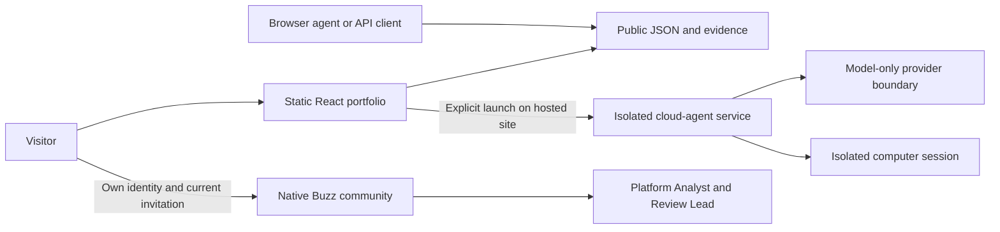

# Public architecture

The portfolio separates a static public record from optional services that perform work.

## This repository

The build prerenders the React page, then hydrates its interactive controls in the browser. `lib/portfolio-data.ts`, `lib/machine-profile.ts`, and `lib/infrastructure-data.ts` hold the public record. Export scripts generate JSON, plain text, and API documentation from that record rather than maintaining an unrelated copy.

The evidence dashboard, horizontal project gallery, app previews, and capacity explorer run in the frontend. The WebMCP registration exposes read-only public information and a deterministic calculation when the browser supports that API; it is optional and does not replace the ordinary HTTP interfaces.

## Hosted services

Cloud-agent sessions, computer access, model credentials, quotas, egress controls, native community identity, signing, and agent workers are deployed separately. The public adapter describes the browser boundary without publishing the private implementation or operational configuration.

A successful static build does not prove that a separately hosted model, microphone, computer, or community is available. Those experiences need their own end-to-end verification. This source release does not start or simulate them locally.

## Compute ownership

The public community currently demonstrates commercial-model cloud agents. Community-hosted open-weight inference is a separate direction: a participant deliberately contributes a model endpoint and capacity. A commercial subscription or API and a locally hosted open-weight model have different ownership and data paths, and are described accordingly.

## Evidence boundaries

Visa career outcomes, Elygent integration work, frontend calculations, screenshots, and emerging research directions are labeled separately. Private employer photographs, source code, service catalogs, customer data, owner community history, and operational credentials are not public artifacts.
